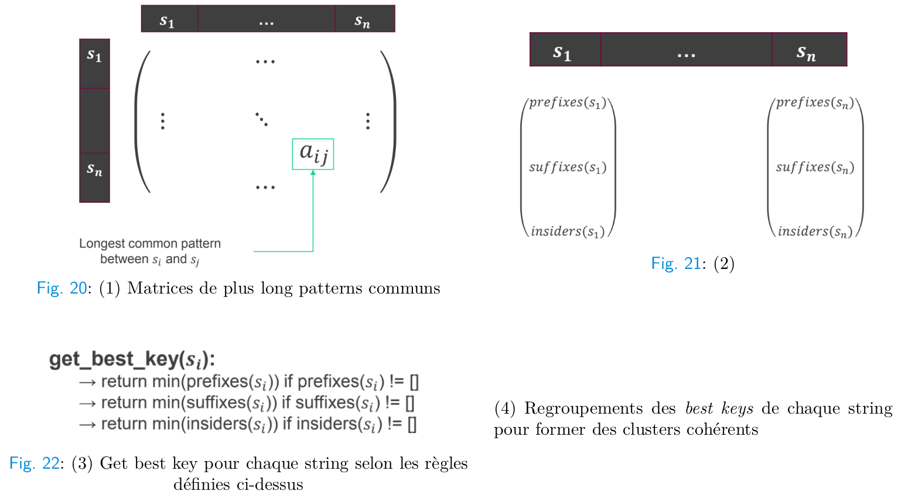

# Longuest Common Substring Clustering Guide

Les paramètres d’entrée sont ``min_samples`` (le nombre minimum d’éléments nécessaires pour former un cluster) et
``min_pattern_size`` (la taille minimale de la chaîne de caractère qui caractérise un cluster). Puis l’algorithme est le suivant :

1. Calcul de la matrice de plus long patterns communs (matrice symétrique donc n^2 / 2 calculs).

2. Regroupements différenciés entre les préfixes, suffixes et insiders : on prend la colonne ou bien la
ligne correspondant à si dans la matrice précédente, on enlève tous les patterns communs de taille inférieure
à min\_pattern\_size et on les classe ensemble si ce sont des préfixes, des suffixes ou bien des patterns de milieux
de mot.

3. Get best key : pour chaque string, on sélectionne la ”meilleure clé” selon le critère décrit dans la figure ci-dessus.
En l’occurrence, un avantage est donné à la sélection d’un préfixe sur les suffixes et les patterns de milieux de
mots. C’est un critère demandé par le client car les préfixes sont plus souvent utilisés. D’autre part c’est le pattern
de plus petite racine qui est retenu car cela permet de regrouper plus d’éléments ensemble, quitte à proposer un
nouveau regroupement plus pousser sur le cluster fraichement formé.

4. Regroupements des best keys pour former des clusters cohérents : on regroupe les best keys de chaque
string ensemble. Si un pattern contient plus de min\_samples éléments alors un cluster est formé avec les strings
associés.

5. Deuxième vague (repêchage des éléments du cluster ’None’) : à cause du choix arbitraire du minimum
dans la fonction get\_best\_key() , certains cas pathologiques peuvent apparaître dans le cluster ’None’ notamment
si on a privilégié un préfixe qui n’a pas permis de créer un cluster alors que le mot possède également un suffixe
qui a pu être ’transformé’ en cluster. Cette deuxième vague va permettre de repêcher tous ceux qui peuvent
malgré tout être attribués à des clusters déjà formés, laissant dans le cluster ’None’ le moins d’éléments possible,
pour que l’analyste puisse prioriser son temps d’investigation aux assets vraiment isolés en termes de nomenclature.

 